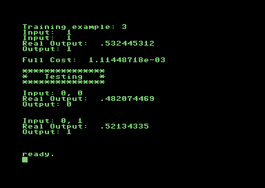

# Another DNN implementation for commodore64
 
 

## About

a CC65 Floating point C Language DNN implementation for the Commodore 64, can be interactive or there is a logical module (xor) preloaded to quick test. 

This project has an artistic/protest finality, because can be used also
to understand how optimization is much more inportant than code elegance and understanding in some cases, like neural network, where there is intese cpu/gpu workload.

**If a developer writes efficient code, hardware programmed obsolescence can be fighted and the planet and nature saved**  

### Install support software

* Download [cc65](https://cc65.github.io/) to compile or sudo apt-get install -y cc65
* Install [vice](https://jolyonbrown.com/post/vice-on-ubuntu/) following these instructions
* Download [cc65-floatlib](https://github.com/mrdudz/cc65-floatlib) clone and build where there is c64dnn repo 

### Command Line to build

```bash
# clone repo
git clone https://github.com/dexmac221/c64dnn

# clone cc65 float library
git clone https://github.com/mrdudz/cc65-floatlib

# compile float library
cd cc65-floatlib
make
cd..

# compile all
cd c64dnn

# to compile for commodore 64
make TARGET=c64

#run the generate commodore 64 binary code
x64 c64dnn.prg
```

## Supported platforms

* Commodore 64
  
## References

* [Neural-Network-framework-using-Backpropogation-in-C](https://github.com/mayurbhole/Neural-Network-framework-using-Backpropogation-in-C)
* [CC65 Float library](https://github.com/mrdudz/cc65-floatlib) 

## License

* [Apache v2](http://www.apache.org/licenses/LICENSE-2.0)

